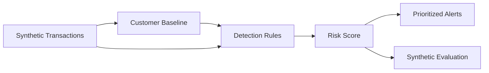

# Fraud Risk Engine

[](https://github.com/seoyeonglee/fraud-risk-engine/actions/workflows/tests.yml)

An explainable Python fraud-risk pipeline that combines customer baselines, transaction-pattern rules, velocity detection, and transparent risk scoring.

> This repository uses synthetic data only. It does not contain or reproduce bank, exchange, card, customer, or employer data, thresholds, models, or internal fraud logic.

## What it detects

- unusually high transaction amounts
- amount spikes relative to a customer's baseline
- new countries
- new devices
- illustrative high-risk merchant categories
- high transaction velocity
- rapid cash-out patterns

Each signal contributes to a 0–100 risk score.

## Architecture



## Example

A synthetic customer transaction from a new country and device, at an unusually high amount and in a high-risk merchant category, can trigger:

- `HIGH_AMOUNT`
- `AMOUNT_SPIKE`
- `NEW_COUNTRY`
- `NEW_DEVICE`
- `HIGH_RISK_MERCHANT`

The score is capped at 100 and remains traceable to the contributing rules.

## Project structure

```text
fraud-risk-engine/
├── data/
│   ├── README.md
│   └── sample_transactions.csv
├── docs/
│   ├── architecture.md
│   └── methodology.md
├── output/
│   ├── sample_alerts.csv
│   └── summary.json
├── src/
│   ├── generate_data.py
│   ├── risk_engine.py
│   ├── rules.py
│   └── run_engine.py
├── tests/
├── requirements.txt
└── README.md
```

## Run it

Windows:

```powershell
py -m venv .venv
.\.venv\Scripts\python.exe -m pip install -r requirements.txt
.\.venv\Scripts\python.exe src\generate_data.py
.\.venv\Scripts\python.exe src\run_engine.py
.\.venv\Scripts\python.exe -m pytest -q
```

macOS/Linux:

```bash
python -m venv .venv
source .venv/bin/activate
pip install -r requirements.txt
python src/generate_data.py
python src/run_engine.py
python -m pytest -q
```

## Outputs

`output/sample_alerts.csv` contains transaction context, triggered rules, risk score, and severity.

`output/summary.json` contains run-level metrics. When the generator-created dataset is used, the engine also evaluates against injected synthetic labels. Those metrics demonstrate pipeline behavior only and are not real-world model-accuracy claims.

## Design principles

- **Explainable:** every alert is tied to named rules
- **Reproducible:** deterministic synthetic-data generation
- **Public-safe:** no real customer or employer data
- **Control-oriented:** thresholds and assumptions are documented and testable

See [`docs/methodology.md`](docs/methodology.md) for limitations and production considerations.

## Tech

Python · Pandas · Fraud Analytics · Rule Engine · Behavioral Baselines · Risk Scoring
