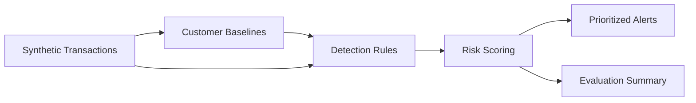

# Architecture

The engine separates detection from scoring so each control can be reviewed, tuned, and tested independently.

## Pipeline

1. Build customer-specific amount, country, and device baselines from ordinary synthetic history.
2. Apply event-level rules.
3. Detect short-window velocity and rapid cash-out sequences.
4. Convert triggered rules into an explainable 0–100 score.
5. Export alerts and synthetic evaluation metrics.
